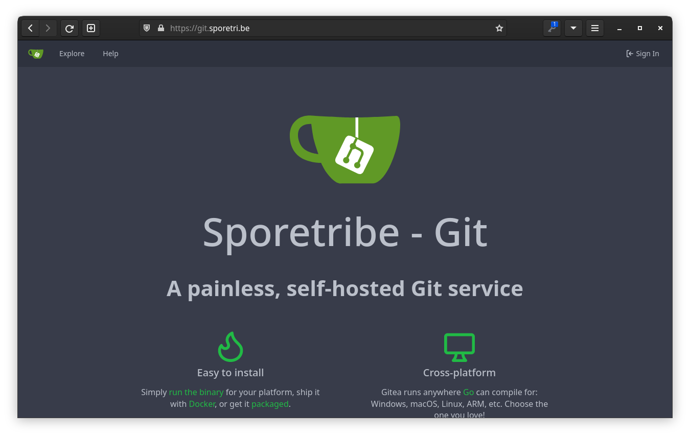
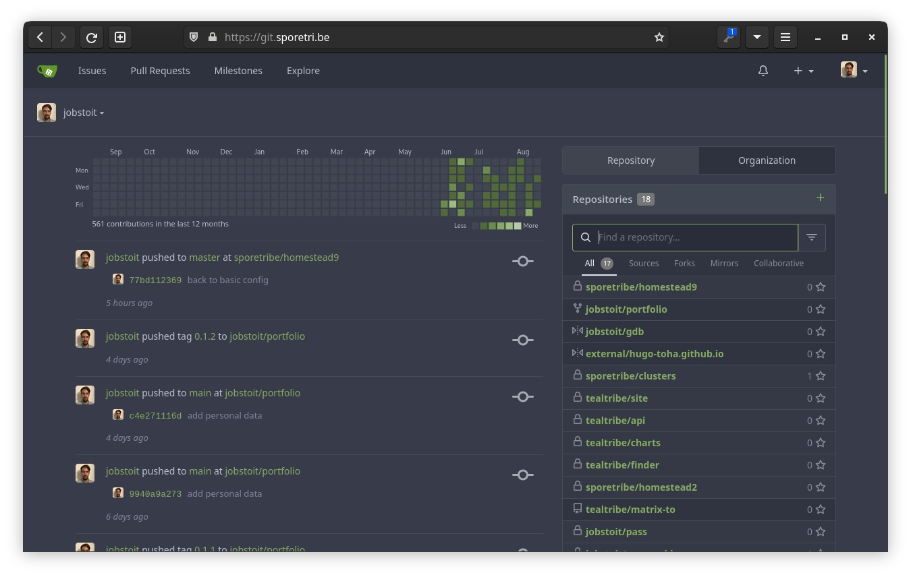
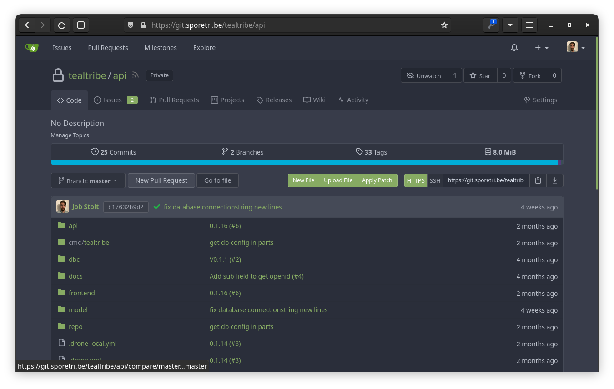
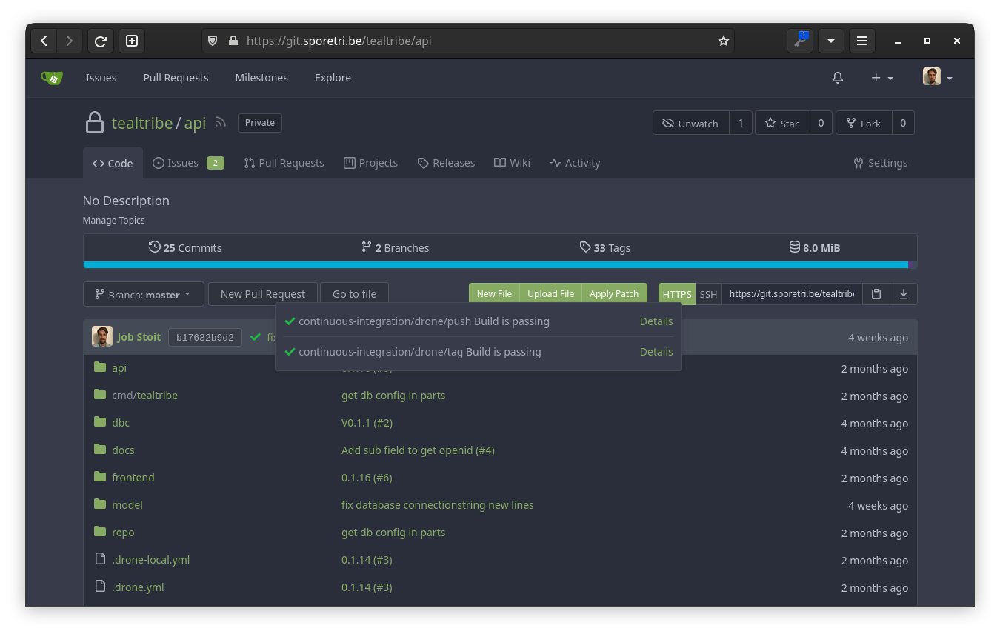
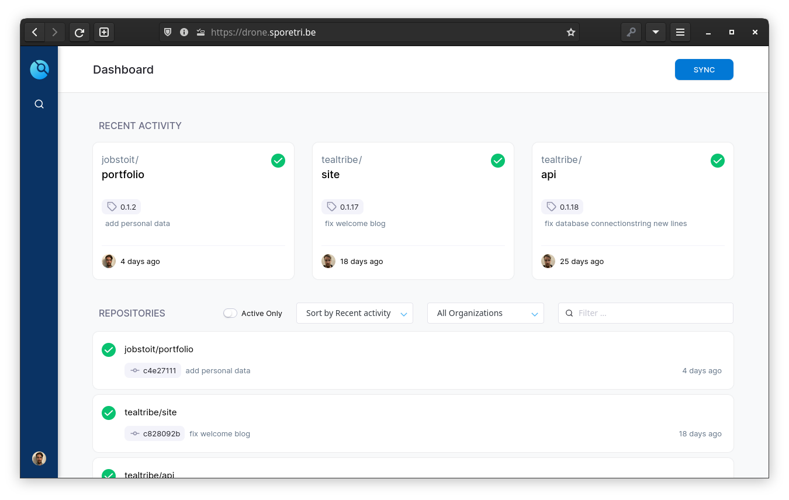
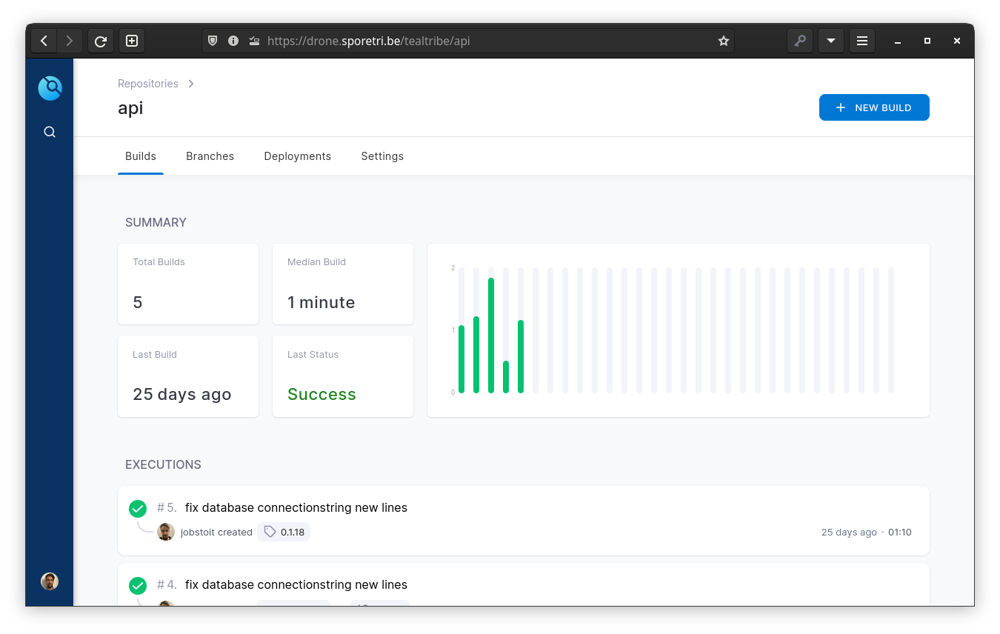
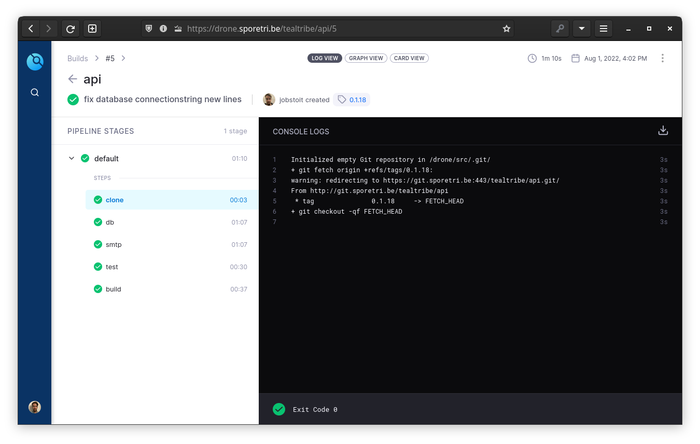

Hosting my own [gitea](https://gitea.io) server along with [Drone CI/CD](https://drone.io).
Hosted in a [Kubernetes](https://kubernetes.io) cluster on [Hetzner cloud](https://console.hetzner.cloud/) infrastructure

## Gitea

## Drone

